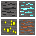
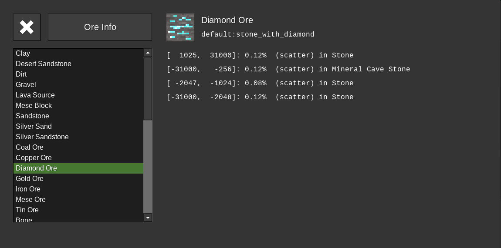

# Ore Info [ore_info]

The Ore Info mod creates a menu to view the depth and rarity of groups in which ores generate.
Created by TwigGlenn4 

## Usage
Type `/ore_info` or click the  button in your inventory to open the menu.
Select an item from the list on the left to view it's stats.

## Compatibility
The following inventory mods are supported and have buttons to open Ore Info.
* [Unified Inventory](https://content.luanti.org/packages/RealBadAngel/unified_inventory/)
* [sfinv (Simple Fast Inventory)](https://content.luanti.org/packages/rubenwardy/sfinv/) (This is the default inventory in Minetest Game)
* [Inventory Plus](https://content.luanti.org/packages/TenPlus1/inventory_plus/)

Since Ore Info scans Luanti's registered ores, it should be compatible with most mods.

### Luanti
Ore Info v1.2.1 has been developed and tested on Luanti 5.12.0

## Credits

* Ore Info is licensed with the MIT license, see [`LICENSE.md`](LICENSE.md) for details.
* Thanks to [adikalon](https://github.com/adikalon) for adding Extended Tooltips support and fixing a crash when previewing animated nodes.
